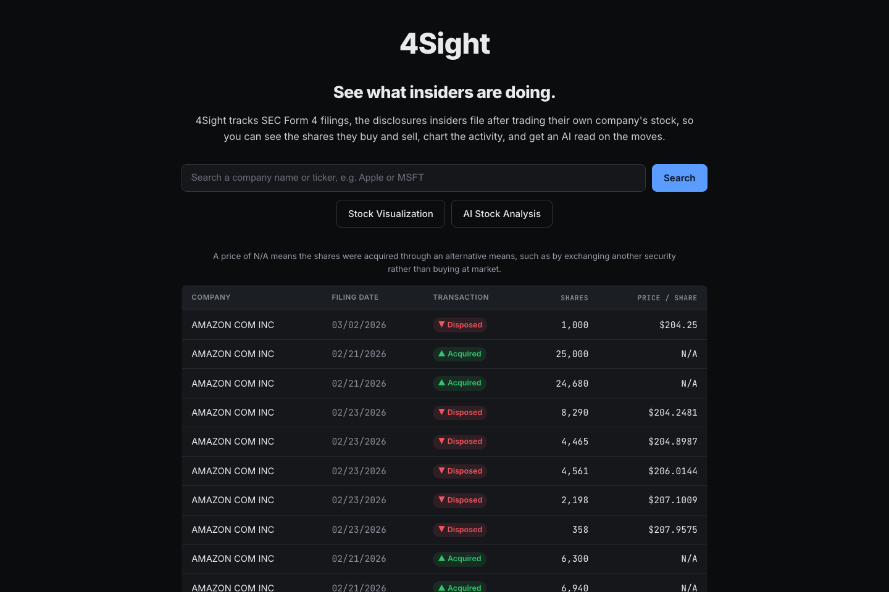

# 4Sight

A web app for exploring SEC Form 4 filings: search a company, browse insider transactions, and chart shares acquired versus disposed.

[Live demo](https://4-sight-mu.vercel.app/)



## How it works

Flask handles company searches and resolves tickers to SEC company identifiers. The scraper reads EDGAR's filing feed, finds each filing's ownership XML, and extracts non-derivative transactions. Pandas cleans the rows and Matplotlib builds the charts. An optional Claude integration generates possible explanations for the transactions.

The scraper runs in-process, charts stay in memory, and downloaded CSVs go to `/tmp` so the app can run on Vercel's read-only filesystem. A bundled Amazon filing snapshot makes the table and charts usable without API keys or live SEC requests.

## Run locally

Requires Python 3.11 or later. From this directory:

```bash
python -m venv .venv
source .venv/bin/activate
pip install -r requirements.txt
python -m flask --app app run
```

Open http://localhost:5000. For AI analysis, set `ANTHROPIC_API_KEY` in your shell before starting the server. The table and charts work without it.

## Tests

```bash
pip install -r requirements-dev.txt
python -m pytest
```

Tests cover ownership XML parsing, numeric cleanup, chart generation, and the bundled-data routes without contacting external services.

## Limits

Live searches depend on Yahoo Finance and SEC availability and process at most 25 recent filings. The AI analysis does not fetch current news or verify its explanations. The bundled data is a snapshot, not a live feed.
